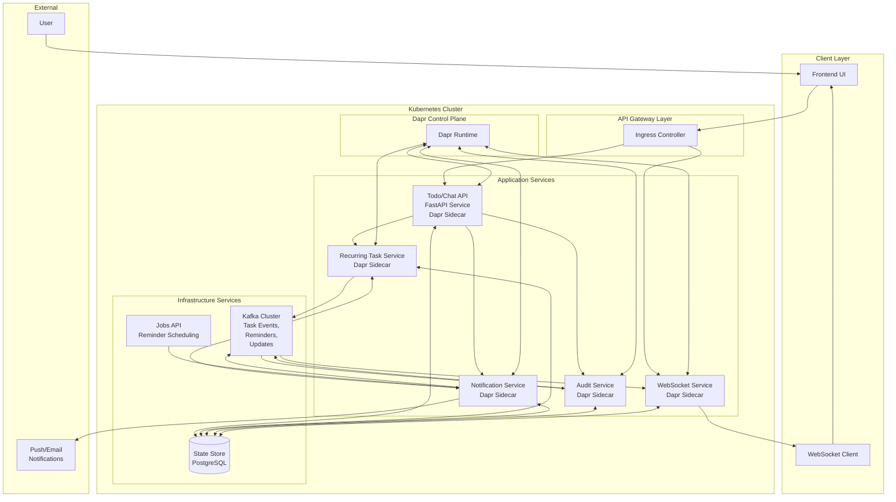

# Implementation Plan: Advanced Cloud-Native Todo Chatbot with Kafka, Dapr & Real-time Sync

**Branch**: `5-phase-v-cloud-native-dapr-kafka` | **Date**: 2026-02-03 | **Spec**: [/mnt/d/Hackathon-II/todo-app/specs/phase-V-cloud-deployment/spec.md](file:///mnt/d/Hackathon-II/todo-app/specs/phase-V-cloud-deployment/spec.md)
**Input**: Feature specification from `/specs/phase-V-cloud-deployment/spec.md`

**Note**: This template is filled in by the `/sp.plan` command. See `.specify/templates/commands/plan.md` for the execution workflow.

## Summary

Implementation of an advanced cloud-native todo chatbot system with event-driven architecture using Kafka and Dapr. The system will feature recurring tasks, exact-time reminders, real-time synchronization, and deployment on Kubernetes. This includes 5 specialized services: Todo/Chat API, Recurring Task, Notification/Reminder, Audit/Logging, and Real-time Sync (WebSocket). The architecture will be fully event-driven with proper service separation and Dapr abstraction to prevent vendor lock-in.

## Technical Context

**Language/Version**: Python 3.13+ (FastAPI), TypeScript 5.0+ (Next.js), JavaScript/Node.js (Kafka consumers)
**Primary Dependencies**: FastAPI 0.115+, Dapr 1.12+, Kafka/Redpanda, SQLModel 0.0.24+, Next.js 16+, WebSocket
**Storage**: PostgreSQL 15+ via Neon DB (serverless), Dapr State Store, Kafka Topics
**Testing**: Pytest 8.0+ with pytest-asyncio, Jest for frontend, integration tests for event flows
**Target Platform**: Kubernetes (local Minikube → production cloud AKS/GKE/OKE)
**Project Type**: Web application with microservices architecture
**Performance Goals**: <500ms response time, handle 1000 concurrent WebSocket connections, <5-second variance for reminders
**Constraints**: All services communicate via Dapr without direct Kafka/DB calls in core logic, 99% success rate for recurring task generation, real-time sync within 500ms
**Scale/Scope**: 10,000+ tasks per user, 1000+ concurrent users, 99% availability for notification delivery

## Constitution Check

*GATE: Must pass before Phase 0 research. Re-check after Phase 1 design.*

Constitution principles that must be verified:
- ✅ Spec-Driven Development (SDD): All code originates from approved specifications
- ✅ Progressive Evolution: Sequential phase completion (I → II → III → IV → V)
- ✅ Cloud Native Architecture: Stateless, scalable, containerized services
- ✅ AI Agent Integration: Natural language processing and intelligent features
- ✅ Security & Authentication: JWT-based user isolation
- ✅ Event-Driven Design: Asynchronous events and notifications
- ✅ Correctness and Predictability: Graceful error handling
- ✅ Maintainability and Extensibility: Clean, modular code
- ✅ AI-Assisted Development: Claude Code with Spec-Kit Plus methodology

## Project Structure

### Documentation (this feature)

```text
specs/phase-V-cloud-deployment/
├── plan.md              # This file (/sp.plan command output)
├── research.md          # Phase 0 output (/sp.plan command)
├── data-model.md        # Phase 1 output (/sp.plan command)
├── quickstart.md        # Phase 1 output (/sp.plan command)
├── contracts/           # Phase 1 output (/sp.plan command)
└── tasks.md             # Phase 2 output (/sp.tasks command - NOT created by /sp.plan)
```

### Source Code (repository root)

```text
phase-V-cloud-deployment/           # Base codebase extended for Phase V
├── backend/
│   ├── src/
│   │   ├── main.py              # FastAPI app, CORS, middleware
│   │   ├── config.py            # Environment variables, settings
│   │   ├── models/
│   │   │   ├── user.py          # SQLModel User entity
│   │   │   ├── task.py          # SQLModel Task entity (enhanced with recurring, due_at, remind_at, priority, tags)
│   │   │   └── message.py       # SQLModel Message entity
│   │   ├── routers/
│   │   │   ├── auth.py          # POST /api/auth/signup, /login
│   │   │   ├── tasks.py         # Task CRUD endpoints (enhanced)
│   │   │   └── chat.py          # Chat endpoint (enhanced)
│   │   ├── services/
│   │   │   ├── auth_service.py  # Password hashing, JWT logic
│   │   │   ├── task_service.py  # Task business logic (enhanced)
│   │   │   └── chat_service.py  # Chat business logic
│   │   └── core/
│   │       ├── database.py      # SQLModel engine, session
│   │       ├── dependencies.py  # FastAPI dependencies
│   │       ├── security.py      # JWT utilities
│   │       └── dapr_client.py   # Dapr integration utilities
│   ├── tests/
│   │   ├── conftest.py          # Pytest fixtures
│   │   ├── test_auth.py         # Auth endpoint tests
│   │   ├── test_tasks.py        # Task CRUD tests (enhanced)
│   │   ├── test_chat.py         # Chat tests
│   │   └── test_integration.py  # Integration tests for event flows
│   ├── docker/
│   │   ├── Dockerfile.backend   # Multi-stage Dockerfile for backend
│   │   └── .dockerignore
│   ├── dapr/
│   │   ├── components/
│   │   │   ├── kafka-pubsub.yaml     # Kafka pub/sub component
│   │   │   ├── statestore.yaml       # State store component
│   │   │   ├── secrets.yaml          # Secrets management
│   │   │   └── jobs.yaml             # Jobs API component
│   │   └── config.yaml               # Dapr configuration
│   ├── requirements.txt
│   ├── pyproject.toml
│   └── uv.lock
├── frontend/
│   ├── app/                 # Next.js App Router pages and layouts
│   │   ├── (auth)/          # Authentication-related routes
│   │   ├── dashboard/
│   │   ├── tasks/
│   │   ├── layout.tsx
│   │   ├── page.tsx
│   │   └── globals.css
│   ├── components/          # Reusable UI components
│   │   ├── ui/              # Base UI components
│   │   ├── auth/            # Authentication components
│   │   ├── tasks/           # Task-related components (enhanced)
│   │   └── layout/          # Layout components
│   ├── lib/                 # Shared utilities and API functions
│   │   ├── auth.ts
│   │   ├── api.ts
│   │   └── types.ts
│   ├── services/            # API service layer
│   │   ├── auth-service.ts
│   │   └── task-service.ts
│   ├── hooks/               # Custom React hooks
│   │   ├── useAuth.ts
│   │   ├── useTasks.ts
│   │   └── useWebSocket.ts  # WebSocket connection hook
│   ├── public/              # Static assets
│   ├── package.json
│   ├── tsconfig.json
│   └── next.config.mjs
├── services/
│   ├── recurring-task-service/     # Recurring task handler (Python/FastAPI)
│   ├── notification-service/       # Reminder/notifications handler (Python/FastAPI)
│   ├── audit-service/              # Audit logging handler (Python/FastAPI)
│   └── websocket-service/          # Real-time sync handler (Python/FastAPI + WebSocket)
├── helm/todo-chart/               # Helm chart for deployment
│   ├── Chart.yaml
│   ├── values.yaml
│   ├── templates/
│   │   ├── backend-deployment.yaml
│   │   ├── backend-service.yaml
│   │   ├── frontend-deployment.yaml
│   │   ├── frontend-service.yaml
│   │   ├── recurring-task-deployment.yaml
│   │   ├── notification-deployment.yaml
│   │   ├── audit-deployment.yaml
│   │   ├── websocket-deployment.yaml
│   │   ├── kafka-deployment.yaml
│   │   └── ingress.yaml
│   └── charts/                    # Subcharts
├── docker/
│   ├── Dockerfile.backend
│   ├── Dockerfile.frontend
│   └── Dockerfile.service-base    # Base image for microservices
├── k8s/                         # Kubernetes manifests
│   ├── kafka/
│   ├── dapr/
│   └── monitoring/
├── .github/workflows/           # CI/CD pipelines
│   ├── build-and-test.yml
│   ├── deploy-minikube.yml
│   └── deploy-cloud.yml
└── README.md
```

**Structure Decision**: The existing phase-II-full-stack-todo codebase will be extended to include the new event-driven architecture. The monorepo approach maintains all services in a single repository for simplicity while maintaining clear separation between services. New microservices will be added in the services/ directory with appropriate Dapr sidecars for pub/sub and state management.

## Complexity Tracking

> **Fill ONLY if Constitution Check has violations that must be justified**

| Violation | Why Needed | Simpler Alternative Rejected Because |
|-----------|------------|-------------------------------------|
| Multiple services | Event-driven architecture requires separation of concerns | Single service would create tight coupling and reduce resilience |
| Dapr integration | Abstraction layer needed to prevent vendor lock-in | Direct Kafka/DB calls would tie system to specific implementations |
| WebSocket implementation | Real-time sync requires bidirectional communication | Polling would create unnecessary load and latency |

## Architecture Diagram



## Implementation Roadmap

### Phase 0: Research & Architecture Design
- Research Kafka options: Strimzi vs Redpanda vs Confluent
- Research Dapr components and integration patterns
- Design event schemas for task-events, reminders, task-updates topics
- Define service contracts and inter-service communication patterns
- Create detailed architecture diagrams

### Phase 1: Data Model & Service Contracts
- Extend Task model with recurring, due_at, remind_at, priority, tags fields
- Design API contracts for all 5 services
- Create event schemas for Kafka topics
- Define Dapr component configurations
- Set up development environment with Dapr and Kafka

### Phase 2: Core Infrastructure Setup
- Set up Kafka/Redpanda in Kubernetes
- Configure Dapr components (pub/sub, state store, secrets, jobs)
- Update existing backend to use Dapr for DB operations
- Implement basic task CRUD with enhanced model
- Set up monitoring and logging infrastructure

### Phase 3: Service Development
- Implement Recurring Task Service (listens to task-events)
- Implement Notification/Reminder Service (uses Dapr Jobs API)
- Implement Audit Service (logs all task operations)
- Implement WebSocket Service (real-time sync)
- Integrate all services with Dapr and Kafka

### Phase 4: Frontend Updates
- Update UI to support new task fields (priority, tags, due dates)
- Implement WebSocket connection for real-time updates
- Add recurring task configuration UI
- Update chatbot to work with event-driven architecture

### Phase 5: Deployment & Testing
- Create Helm charts for all services
- Set up local Minikube deployment
- Test event-driven flows end-to-end
- Validate success criteria from specification
- Prepare cloud deployment configurations

## Decision Log

### Kafka Choice
**Decision**: Redpanda Cloud Serverless (free tier) for development and testing, with migration path to self-hosted Strimzi for production
**Rationale**: Zero setup time for development, no Zookeeper needed, excellent Dapr compatibility, free tier sufficient for testing
**Alternatives considered**: Self-hosted Strimzi (more complex setup), Confluent Cloud (cost concerns)

### Dapr vs Direct Libraries
**Decision**: Use Dapr for all service communication
**Rationale**: Provides vendor-neutral abstraction, simplifies service mesh patterns, prevents vendor lock-in
**Tradeoffs**: Slight complexity increase, potential debugging challenges, but benefits outweigh costs

### Single Repo vs Micro-repos
**Decision**: Single repository approach (monorepo)
**Rationale**: Simplifies coordination between services, maintains git history, easier for single developer/team
**Tradeoffs**: Larger repo size, but benefits of coordination and simplified CI/CD outweigh concerns

### Real-time Sync Method
**Decision**: WebSocket for real-time sync
**Rationale**: True bidirectional communication, low latency, good browser support
**Alternatives considered**: Server-Sent Events (unidirectional), polling (higher latency and load)

### Reminder Scheduling
**Decision**: Dapr Jobs API for exact-time reminders
**Rationale**: Native integration with Dapr ecosystem, exact timing, scalable
**Alternatives considered**: Kubernetes CronJobs (less precision), DB polling (higher overhead)

### Cloud Provider
**Decision**: Oracle OKE (Always Free) for initial deployment, with multi-cloud compatibility via Dapr
**Rationale**: Long-term free tier, good for proof-of-concept, Dapr ensures portability
**Alternatives considered**: Azure AKS (12 months), GKE ($300/90 days)

## Testing Strategy

### Unit Tests
- Pytest for each service with mock Dapr calls
- Component-level testing for event processing logic
- Validation of business rules and data integrity

### Integration Tests
- End-to-end event flow testing: task creation → event publish → service consumption → action
- Cross-service communication validation
- Dapr component integration testing

### End-to-End Tests
- Full user journey testing from UI to backend to services
- Real-time sync validation across multiple clients
- Reminder delivery timing validation

### Validation Checks
- Verify recurring tasks auto-create next instance
- Confirm real-time sync occurs within 500ms
- Validate complete audit logging
- Ensure Dapr abstraction is used without direct Kafka/DB calls